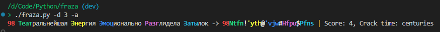

# fraza

Simple password generator using passphrase in Russian

### Правила формирования пароля:

- Пароль создается на основе **парольной фразы** на русском языке;
- Беруться первые несколько букв из каждого слова в парольной фразе;
- Пароль набирается в ангийской раскладке клавиатуры;
- Дополнительно могут добавлятся числа, спецсимволы, разные регистры.

Идея правил генерации была вдохновлена парольным генератором в продуктах ViPNet.

### Правила генерации парольной фразы:

`password phrase = (attribute)+ subject + (adverbial) + predicate + object`

где:

- subject - подлежащие ;
- object - дополнение;
- predicate - сказуемое;
- attribute - определение;
- adverbial - обстоятельство.

Парольная фраза генерируется случайно на основе размеченного [словаря](tagged_words_full.json). Пример структуры словаря представлен ниже:

```
{
  "subject": [
    {
      "word": "цезарь",
      "normal_form": "цезарь",
      "pos": "NOUN",
      "gender": "masc",
      "number": "sing",
      "case": "nomn",
      "inflections": {
        "(nomn, sing, masc)": "цезарь",
        "(accs, sing, masc)": "цезаря",
        ...
      }
    }
  ],
  ...
}
```

_Замечание_- морфологическая связность в фразах не полная. Фразы зачастую генерируются не складно.

### Аргументы

- d (--difficulty), сложность пароля по **уровням** (1:simple, 2:standart, 3:complex);
- f (--file), путь до файла с паролями на выходе;
- w (--word), количество слов в фразе (max = 5);
- l (--letter), количество букв из каждого слова (max = 4);
- n (--number), добавить число в начало пароля (10-99);
- c (--capitalized), использовать заглавные буквы в начале слов;
- wc (--wildcard), использовать спецсимвол в пароле, разграничители между словами в парольной фразе по очереди (!, @, #, $, %, ^, &, \*).
- a (--analyze), произвести оценку сложности пароля, вывод оценки (1-4) и вывод времени времени взлома.

По умолчанию генерация одного простого пароля.

Генерация паролей трех уровней:
| Уровень | Слова | Буквы | Число | Заглавные | Спецсимволы |
| -------- | ----- | ----- | ----- | --------- | ----------- |
| simple | 4 | 3 | Нет | Нет | Нет |
| standart | 4 | 4 | Да | Да | Нет |
| complex | 5 | 4 | Да | Да | Да |

### Примеры использования

```
/d/Code/Python/fraza (dev)
> ./fraza.py
необъяснимая духовность принудила перечень -> ytjle[ghbgth

/d/Code/Python/fraza (dev)
> ./fraza.py -d 3 -p 5 -a
44 Практическое Проектирование Потом Воспроизвело Здоровье -> 44Ghfr!Ghjt@Gjnj#Djcg$Pljh | Score: 4, Crack time: centuries
87 Разумный Сосок Сердито Способствовать Торжество -> 87Hfpe!Cjcj@Cthl#Cgjc$Njh; | Score: 4, Crack time: centuries
25 Международный Диабет Полезно Испугал Сервер -> 25Vt;l!Lbf,@Gjkt#Bcge$Cthd | Score: 4, Crack time: centuries
31 Оптическое Приветствие Непременно Перевело Порядок -> 31Jgnb!Ghbd@Ytgh#Gtht$Gjhz | Score: 4, Crack time: centuries
97 Механический Аборт Теоретически Останавливал Рубеж -> 97Vt[f!F,jh@Ntjh#Jcnf$He,t | Score: 4, Crack time: centuries

/d/Code/Python/fraza (dev)
> ./fraza.py -w 5 -l 3 -c -n --wc -a
52 Беспомощнейшая Проблема Незаметно Развалилась Обслуживание -> 52,tc!Ghj@Ytp#Hfp$J,c | Score: 4, Crack time: centuries
```



### Оценка сложности пароля

Сложность пароля проверяется с помощью библиотеки [zxcvbn](https://github.com/dropbox/zxcvbn.git).
Вывод итоговой оценки `result.score`- целое число от 0 (очень слабый) до 4 (очень сильный).
Оценка времени взлома берётся из параметра `offline_fast_hashing_1e10_per_second` — оффлайн-атака с быстрым хэшированием, предполагающая 10 миллиардов попыток в секунду.

### Установка

Используй скрипт [installiation.sh](installiation.sh):
```
chmod 755 installiation.sh
./installiation.sh
```

Или самому произвести следующие действия:

1. Обновление и установка необходимых инструментов:

```
sudo apt update
sudo apt install git python3 python3-pip
```

2. Установи Pyinstaller:

```
pip3 install --user pyinstaller
```

3. Клонируй репозиторий:

```
git clone https://github.com/ADspecial/fraza.git
cd fraza
```

4. Установи зависимости:

```
pip3 install --user -r requirements.txt
```

5. Собери исполняемый файл:

```
pyinstaller --onefile --add-data "tagged_words_full.json:." fraza.py
```

6. Скопируй бинарник в системный путь для удобного запуска:

```
sudo cp ./dist/fraza /usr/local/bin/
```

7. Запуск приложение командой:

```
fraza
```

В папке dist лежат готовые бинарники для Windows и Linux — можно использовать без установки Python.

_Дополнительно_ можно сформировать свой словарь с помощью скрипта [gendict.py](gendict.py):

```
python gendict.py [путь_до_списка_слов.txt]
```
